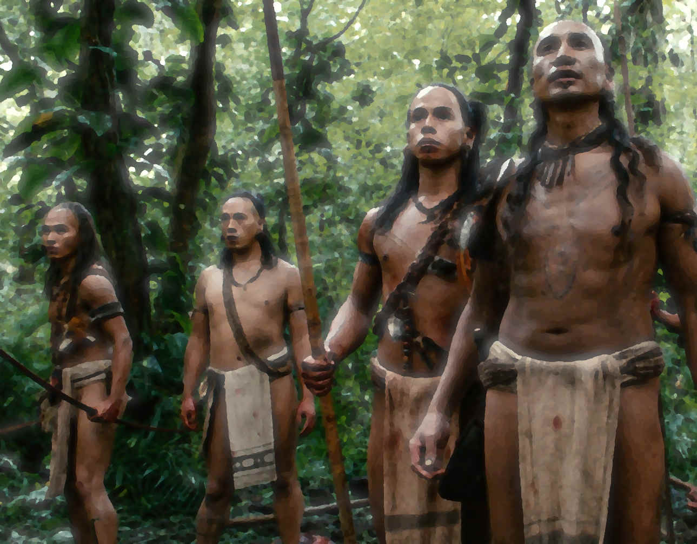
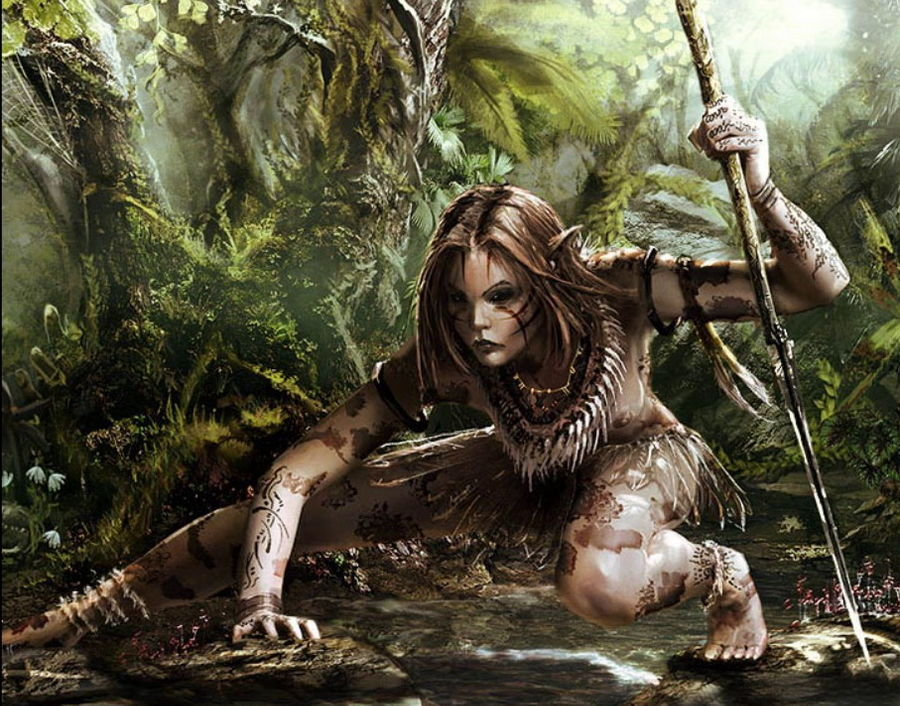

# Hahmokirjasto

!!! info inline end
    

## Kylän taistelujohtaja: UrKii
- Draamakoukut:
    - Sinun pitäisi pyydystä merenneito näyttääksesi kaikille voimasi
    - Sinun pitäisi saada kylänvanhin vakuutettua sallimaan hyökkäys temppelin
      viereisessä huoneessa olevaa luurankoa vastaan, vaikkei tämä ole koskaan
      liikuttanut sormeakaan.
- Advantages:
    - Keen-Eyed (When Observing, sees your strengths or weaknesses)
    - Gritted Teeth
    - Lightning Fast (Hard to hit and hits back harder)
- Disadvantages:
    - Kivikautinen: Ei mitään kirjoituskieltä, laskutaito vain viiteen, ei osaa
      tehdä tai käyttää tulta
    - Puuttuva sormi jonka takia ei halua lainkaan laskea
    - Verenhimo (täytyy vangita ja syödä jokin pieneläin joka päivä tai alkaa
      heikottaa)
- Dark secret:
    - henkien hyljeksimä
- Esineet, voit kantaa kahta:
    - keihäs terävällä kivikärjellä (stab[3], trip[0])
    - kasveista punottu köysi
- Attributes:
    - Fortitude +1, Reflexes +3, and Willpower +0.
    - Charisma +1, Coolness -1, Intuition 0, Perception +2, Reason, Soul +1,
      Violence +3.
- Ulkonäkö:
    - Vaatetus: turkisrievut sidottu hauisten ja nilkkojen ympärille
    - Naama ja Silmät: vapaasti valittavissa
    - Keho: kaikki rintaluut näkyvät selvästi ja vatsa on kuopalla, mutta
      käsissä on kylän suurimmat lihakset.
    - Mielileikki: viidakoneläinten keihästäminen
- Suhteet:
    - +1 Kylänvanhin
    - +1 Henkishamaani
- Experience pisteet yhteensä: 17 (valitse yksi kehitys/5 pistettä)
    - [\_][\_][\_][\_][\_] Increase one active Attribute +1 (to max +3).
    - [X][\_] Increase one passive Attribute +1 (to max +3).
    - [\_] Increase any one active or passive Attribute +1 (to max +4).
    - [X][X][\_] Select a new Advantage from your Archetype.
    - [\_][\_][\_][\_][\_] Remember something about your Dark Secret.
- Harm Moves:
    - [\_] Väisti hyökkäyksen salamannopealla liikkeellä
    - [\_] Haavoittunut
    - [\_] Kuolettavasti haavoittunut (mutta pelastettavissa)
    - [\_] Kuollut

## Valmishahmo: Iaa
!!! info inline end
    
- Draamakoukut:
    - Sinun pitäisi vakuuttaa muut rohkeudestasi houkuttelemalla merenneito
      esiin pitämällä pyydystettyä eläintä kepin päässä lähellä veden pintaa.
    - Sinun pitäisi kertoa kylänvanhimmalle sinun maistaneesi omenaa, vaikka se
      on täysin kiellettyä. (muttei heti ensimmäisellä pelikerralla)
- Advantages:
    - Gritted Teeth (hoitamattomat haavat eivät anna miinuksia)
- Disadvantages:
    - Kivikautinen: Ei mitään kirjoituskieltä, laskutaito vain viiteen, ei osaa
      tehdä tai käyttää tulta
    - Kala-allergia
- Dark secret: löytyi taaperona kylän reunalta
- Esineet, voit kantaa kahta:
    - kädenpituinen puunuija (pummel[2]), knock out[1])
    - haavan hoitoyrttejä (stabiloi Serious Wound, 2 käyttökertaa)
- Attributes:
    - Fortitude +2, Reflexes +0, and Willpower +1
    - Charisma -1, Coolness +1, Intuition +1, Perception -2, Reason 0, Soul +2,
      and Violence +3.
- Ulkonäkö:
    - Vaatetus: olet alasti lämpimässä viidakossa, kaulan ympärille kaisloista
      punottu koriste
    - Leveät kasvot ja hieman suipot korvat, täysin siniset silmät
    - Keho: lyhyt ja jänteikäs, pitkä mutta melkein kokonaan haalistunut arpi
      keskellä rintaa kaulasta vyötärölle asti.
- Nimi: Iaa
- Mielileikkisi: puihin kiipeily
- Suhteet:
    - +1 muihin ryhmän jäseniin
    - +1 Henkishamaani
    - (ensimmäisen pelikerran jälkeen) +2 yhteen ryhmäsi jäsenistä jota salaa
      ihailet, määrittele miksi
- Experience pisteet: 0 (valitse yksi kehitys/5 pistettä)
    - [\_][\_][\_][\_][\_] Increase one active Attribute +1 (to max +3).
    - [\_][\_] Increase one passive Attribute +1 (to max +3).
    - [\_] Increase any one Attribute +1 (to max +4).
    - [\_][\_][\_] Select a new Advantage from your Archetype.
    - [\_][\_][\_][\_][\_] Remember something about your Dark Secret.

## Hahmopohja: Viidakkoteini

Tämä on viety valmiiseen google docs [hahmopohjaan](
https://docs.google.com/document/d/12GgpXw3E7TYYaB_wxTtFY50O32JBcpxFzKKRtiVQZTs/edit).
Käytä sitä ellet itse halua säätää muotoilua järkeväksi.

- Draamakoukut, valitse kaksi:
    - Sinun pitäisi lähteä kavereittesi kanssa tutkimaan yhtä teille aikaisemmin
      uutta kohdetta, määrittele mikä [tunnetuista seikkailukohteista](
      https://gist.github.com/kimb/7435314c86cdd540e73d620c934c2f21#tunnetut-seikkailukohteet).
    - Sinun pitäisi vakuuttaa muut rohkeudestasi uhkarohkealla teolla, valitse
      teko, esim. keinuile liaaniköyden varassa lähellä järvenpintaa, kahlaamalla
      syvemälle järviveteen kuin kukaan muu teistä on aikaisemmin mennyt,
      houkuttele merenneito teidän nähtäväksi kepin päähän kiinnitetyllä viidakon
      eläimellä.
    - Sinun pitäisi tutkia tarkemmin ja lähempää temppelin alttaria johon
      normaalisti aina jätetään usean askeleen etäisyys.
    - Sinun pitäisi löytää luolista jokin esine jollaista muilla kylässä ei ole.
      Kylässä on jo ohuita nahkakappaleita, mukeja, vateja ja tylppiä pieniä
      kiiltäviä luunpätkiä.
    - Tee retki järven ympäri.
    - Rakenna ja pidä piilossa keihäs jonka kärkeen on kiilattu tervävä kivi,
      vaikka kylän sääntöjen mukaan tämä on kiellettyä.
- Advantages, valitse yksi:
    - Animal Speaker (INTU: eläin tottelee sinua)
    - Battlefield medicine (REA: osaat hoitaa haavoja paremmin ja
      improvisoimalla)
    - Dreamer (SOU: näet sinulle käsittämättömiä unia henkien taikarituaaleista)
    - Escape Artist (COO: pääset liukertelemaan karkuun hankalistakin
      tilanteista)
    - Erotic (CHA: seduce, distract, make jealous, confuse)
    - Forbidden Inspiration (SOU: esim. taikatanssi jolla saat tietoa tai näkyjä)
    - Good Samaritan (kun uhraudut muiden puolesta saat *+1 Stability*)
    - Gritted Teeth (hoitamattomat haavat eivät anna miinuksia)
    - Hunter (PER: väijytä, piilottaminen)
    - Inner Power (SOU: vahva mentaali hyökkäys, kuvaile minkälainen
      voimanlähteesi on)
    - Instinct (PER: tutkimalla asioita saat +2 edun, normaali on +1)
    - Lightning Fast (VIO: pystyt väistämään iskuja ja iskemään kovempaa)
    - Parkour (COO: kiipeä ja ylitä mahdottomilta tuntuvia esteitä)
    - Shadow (PER: pystyt seuraaman salaa ja sinua on hankala seurata)
    - Sneak (COO: piiloudu, löydä vaihtoehtoreittejä ja ohita vartiat)
- Disadvantages:
    - Kivikautinen: Ei mitään kirjoituskieltä, laskutaito vain viiteen, ei osaa
      tehdä tai käyttää tulta
    - Valitse yksi, tai tee oma ehdotus:
        - Helposti rasituksesta väsyvä
        - Merenneitofobia
        - Puuttuva sormi jonka takia ei halua lainkaan laskea
        - Kala-allergia
        - Verenhimo (täytyy vangita ja syödä jokin pieneläin joka päivä tai alkaa
          heikottaa)
        - Luunrankovihaaja (kun olit nuori näit kuinka pikkosiskosi vietiin
          vierestäsi)
        - Mental Compulsion
        - Nemesis (ehdota mikä, esim. vammauttamasi merenneito)
        - Repressed Memories
- Dark secret: asetelman puolesta on jo yksi, mutta halutessasi valitse yksi
  lisää ja mieti siihen liittyvä hahmon tukahdutettu tunne tai ehdota omaa
  ideaa:
    - taikaesine jonka suojeleminen kuluu suvullesi
    - luuranko vei sinut lapsena ja palautti seuraavana yönä
    - olet merenneitojen rannalle jättämä lapsi
    - pidät merenneitoja ihmisiä kauniimpana
    - sinulle on pienestä asti opetettu salaista shamaanirituaalia
    - henkien hyljeksimä
- Esineet, voit kantaa kahta:
    - aseeton (hit and kick[1], disarm[0])
    - tylppä puusauva (stab[1], trip[0])
    - pitkä ohut kalastuskeihäs (fragile; pierce[2])
    - kädenpituinen puunuija (pummel[2]), knock out[1])
    - kivi piikikkäällä nurkalla (crush[2])
    - kasveista punottu köysi
    - haavan hoitoyrttejä (stabiloi yksi *Serious Wound*, 2 käyttökertaa)
    - iso hedelmä janoon ja nälkään (viidakosta näitä löytyy aina lisää)
    - lemmikkieläin (esim. pikkuapina/kilpikonna,papukaija)
    - pyydystetty kala (kun syö puolet jaksaa pitempään ja on vahvempi)
- Attributes:
    - Assign the modifiers +2, +1, and +0 to the three passive attributes:
      Fortitude, Reflexes, and Willpower.
    - Assign the modifiers +3, +2, +1, +1, +0, −1, and −2 to the seven active
      attributes: Charisma, Coolness, Intuition, Perception, Reason, Soul, and
      Violence.
- Ulkonäkö:
    - Vaatetus: olet alasti lämpimässä viidakossa, mutta voit keksiä koruja
    - Naama ja Silmät: vapaasti valittavissa
    - Keho: hontelo tai laiha, muuten vapaa
- Nimi: vain yksi tavu, vasta aikuisena sinulle annetaan toinen.
- Mielileikki: valitse yksi: kivien heittäminen järveen, piilosta, hippaa,
  keihään pituusheitto, kyläshamaanin perässä hiipiminen, puihin kiipeily,
  varpailla rantaveden roiskimista, tai oma idea.
- Suhteet:
    - +1 muihin ryhmän jäseniin
    - +1 kyläläiseen jota arvostat eniten, valitse: Kylänvanhin (kertoo sinulle
      mielellään perinteistä), Kalastusmestari (useiten saat häneltä kalan jos
      pyydät kauniisti), Henkishamaani (kertoo hengistä ja alttareista),
      Rakennusmestari (tietää eri kasvista), Taistelujohtaja (voi vangita elävän
      eläimen).
    - ensimmäisen pelikerran jälkeen: +2 yhteen ryhmäsi jäsenistä jota salaa
      ihailet, määrittele miksi.
- Experience pisteet yhteensä: 0 (valitse yksi kehitys/5 pistettä)
    - [\_][\_][\_][\_][\_] Increase one active Attribute +1 (to max +3).
    - [\_][\_] Increase one passive Attribute +1 (to max +3).
    - [\_] Increase any one active or passive Attribute +1 (to max +4).
    - [\_][\_][\_] Select a new Advantage from your Archetype.
    - [\_][\_][\_][\_][\_] Remember something about your Dark Secret.
- Tausta: Vapaa kertomus eri elämänkokemuksistasi.

<!-- vim: set spelllang=fi,en : -->
