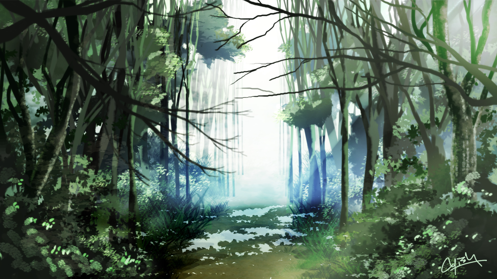
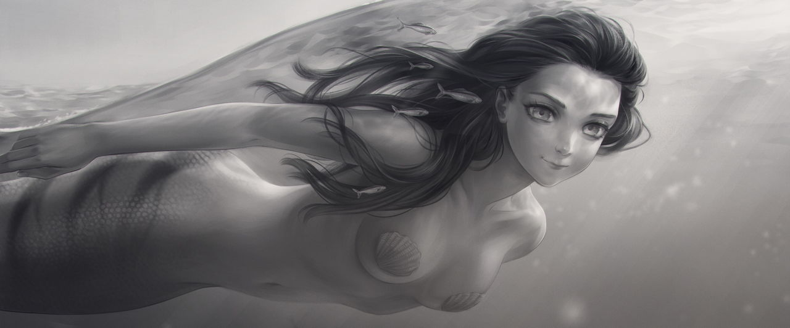

# Miljöö

Heimonne asuu viidakossa järven rannalle rakennetussa kaislamajakylässä.
Kaikki viidakon puut ja pensaat tuottavat syötäviä ja maukkaita hedelmiä.
Paitsi omenat. Kaikki tietävät niiden olevan kirottuja ja tekevän hulluksi.
Järvessä on paljon kaloja ja äyriäisiä joita syömällä tuntee itsensä
vahvemmaksi. Kalastaminen kuitenkin on vaarallista, koska pinnan alla vaanii
armottomia merenneitoja. Viidakossa vilisee paljon pieniä eläimiä, niiden
metsästäminen ei ole kannattavaa koska ne eivät maistu kovin hyviltä ja ovat
sitkeitä.

Syvemällä viidakossa on luolia joihin pitää viedä ruoka-uhrauksia lepyttämään
esi-isien henkiä. Suuttuessaan henget herättävät luolien syvyyksistä kävelevän
kiiltävän luurangon joka tulee ryöstämään kylästä pikkulapsen. Mitä syvemälle
luolaan uhrauksen vie sitä parempi, mutta varoen koska voi helposti eksyä.
Luolista voi myös löytyä hyödyllisiä lahjoja.

Tiivis kaveriryhmänne on koko lapsuutenne yhdessä varttuneita nuoruksia. Nyt
teille on koittanut aika jättää lapsuus taakse. Tämä on yhden kuunkierron koe,
jossa teidän pitää aina päiväksi poistua kylältä viidakkoon. Kylänvanhin kertoi
kuinka teidän pitää käyttää tämä aika ympäristön ja itsenne tutkimiseen, ja
hauskanpitoon. Tämän jälkeen on sitten aika ottaa kylän tehtäviin aikuisena.

Kolmantena aamuna suunnatessane pois kylältä, ryhmänne vilkkain astuu
vahingossa punaisen omenan päälle ja pyyhkäisee sotkun pois kädellään. Kaikki
huudahtavat säikähdyksestä ja pelosta.  Tuleeko pahoja seurauksia jo pelkästä
kielletyn hedelmän koskemisesta? Hetken hiljaisuuden jälkeen kun mitään ei
tapahdu, hän hymyilee ja tokaisee "olen aina miettinyt mille omenat maistuvat,
kenenkään ei tarvitse tietää jos maistamme vain yhden nuolaisun..."

## Yleistietoa

- Tiedät kyllä vanhempasi, mutta kaikki aikuiset kasvattavat lapsia melko
  yhteisöllisesti. Joten synnyinvanhempasi eivät ole kovinkaan
  merkityksellisiä.
- Henkishamaani osaa tulkita luolista löytyvien alttarien henkitarpeita ja
  tietää mitä uhrauksia koska on tehtävä. Jos tämän tekee väärin tai
  puutteellisesti henget suuttuvat.
- Vain aikuiset saavat taisteilla luurankoja vastaan keihäillä joihin on
  kiilattu kivi.
- Viidakon hedelmistä ja kasveista saatte helposti kaiken tarvitsemanne ruuan
  ja juoman. Kukaan ei kerää mitään ruokaa varastoon.
- Viidako jatkuu ainakin usean päivämatkan verran joka suuntaan, paitsi
  poispäin järveltä, jossa vastaan tulee kallioseinämä parin tunnin kävelyn
  jälkeen. Kukaan ei ole kulkenut järven ympäri, koska puolivälissä eteen tulee
  vastaan hankala ja vaarallinen kosteikkoalue jossa merenneidot helposti
  yllättävät.

## Merenneidot

- Merenneitoja näkyy harvoin, mutta voivat vaania heti pinnan alla. Ne ovat
  vaarallisia. Ne hukuttavat ja raatelevat kaikki jotka saavat kiinni.
  Muistatte lapsuudesta tapauksen jossa epäonnekkaasta kalastajasta ei jäänyt
  paljon haudattavaa.
- Vanhemmat kyläläiset osaavat kertoa, etteivät neidot ole paljoa ihmisiä
  kookkaampia, lähinnä pyrstöevän verran pitempiä. Yksi liioittelusta tunnettu
  vanha kalastaja väittää kerran nähneensä hyvin pitkän, melkein käärmemäisen
  yksilön. Itse olette nähneet vain vilaukselta kauempana järvellä hetkeksi
  pinnan yläpuolelle tulleita päitä.

## Seikkailukohteet

- **Juomavesipuro** Kylän vieressä järveen tulee puro jonka alkupäässä on huhujen
  mukaan kaunis vesiputous jossa on kuulma turvallista kylpeä.
- **Kalliotemppeli** Poispäin järveltä reilun tunnin kävelymatkan päässä on lähin
  kallioseinämä, josta alkaa iso luola joka johtaa yhdelle temppeleistä, mutta
  myös pelottavan hämäriin sivukäytäviin joissa ette ole käyneet.
- **Simpukkaranta** Parin niemenkärjen takana on kirkasvesinen ja pitkämatala hiekkaranta.
  Rantavedestä voi kerätä simpukankuoria ja löytää hyvämnakuisia kotiloita.
  Ne vaan täytyy ensin jättää pari tuntia mustan kiven päälle kypsymään.
- **Viidakkoaukea** Korkeimpaan puuhun kiipeämällä yksi teistä on näyhnyt suunnan jossa keskellä
  viidakkoa ei näy puunlatvoja.
- **Suurviidakko** Nousevan auringon suunnassa teräväsilmäisten mukaan kaukana näkyy tavallista
  korkeammista ja isommista puista koostuva viidakko.

<!-- vim: set spelllang=fi: -->
